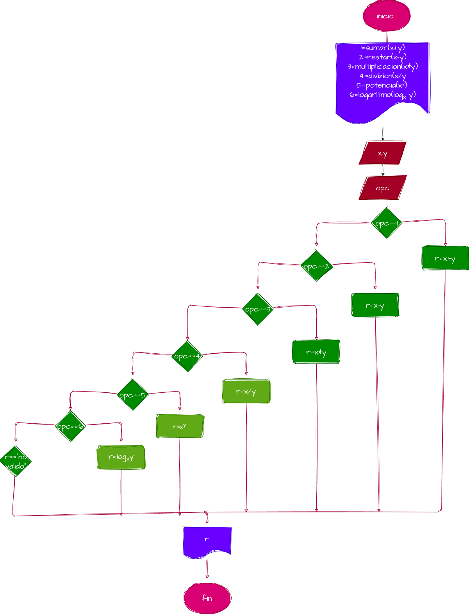

# Minicalculadora-guanentina
minicalculadora
1=sumar(x+y)
2=restar(x-y)
3=multiplicacion(x*y)
4=dividir(x/y)
5=potencia(x^y)
6=logaritmo(logx y)

# entrada de datos
"ingrese el valor de x: "
"ingrese el valor de y: "
"seleccione la operacion a realizar: "

# Alumno: David Santiago Macias Maldonado 
# Alumno: Lesly Gabriela Hernandez Muñoz

# diseño
